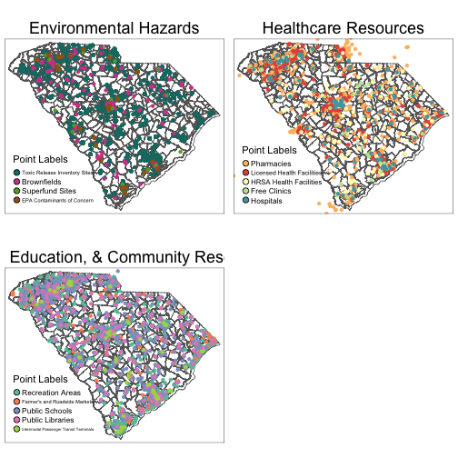

```r
library(tigris)
library(sf)
library(grid)
library(tmap)
library(tmaptools)
#library(dhomer)
library(knitr)
```

# Loading the data

The datastes are not saved as spatial objects, rather with latitude and longitude columns, so we must first convert all of the point data into spatial objects with `st_as_sf`


```r
sc_tracts <- tracts(state = 45)

superfund_map <- superfund %>%
  st_as_sf(coords = c('lon', 'lat'), crs = st_crs(sc_tracts))

brownfields_map <- brownfields %>%
  st_as_sf(coords = c('lon', 'lat'), crs = st_crs(sc_tracts))

tri_map <- tri %>%
  st_as_sf(coords = c('lon', 'lat'), crs = st_crs(sc_tracts))

contaminants_map <- contaminants %>%
  st_as_sf(coords = c('lon', 'lat'), crs = st_crs(sc_tracts))

clinics_map <- free_clinics %>%
  st_as_sf(coords = c('lon', 'lat'), crs = st_crs(sc_tracts))

facilities_map <- health_facilities %>%
  st_as_sf(coords = c('lon', 'lat'), crs = st_crs(sc_tracts))

hospitals_map <- hospitals %>%
  st_as_sf(coords = c('lon', 'lat'), crs = st_crs(sc_tracts))

hrsa_map <- hrsa %>%
  st_as_sf(coords = c('lon', 'lat'), crs = st_crs(sc_tracts))

libraries_map <- libraries %>%
  st_as_sf(coords = c('lon', 'lat'), crs = st_crs(sc_tracts))

markets_map <- markets %>%
  st_as_sf(coords = c('lon', 'lat'), crs = st_crs(sc_tracts))

pharmacies_map <- pharmacies %>%
  st_as_sf(coords = c('lon', 'lat'), crs = st_crs(sc_tracts))

schools_map <- public_schools %>%
  st_as_sf(coords = c('lon', 'lat'), crs = st_crs(sc_tracts))

rec_map <- recreation %>%
  st_as_sf(coords = c('lon', 'lat'), crs = st_crs(sc_tracts))

transit_map <- transit_terminals %>%
  st_as_sf(coords = c('lon', 'lat'), crs = st_crs(sc_tracts))
```

# Mapping the data


```r
plot1 <- tm_shape(sc_tracts) + 
  tm_polygons(col = 'white') +
  tm_layout(main.title = 'Environmental Hazards', 
            main.title.position = c('center','top')) + 
  tm_shape(tri_map) +
  tm_dots(size = 0.1, col = '#157971') +
  tm_shape(brownfields_map) +
  tm_dots(size = 0.1, col = '#D14995') +
  tm_shape(superfund_map) +
  tm_dots(size = 0.1, col = '#66A731') +
  tm_shape(contaminants_map) +
  tm_dots(size = 0.1, col = '#A06418') +
  tm_add_legend(title = 'Point Labels', type = 'symbol', 
                labels = c('Toxic Release Inventory Sites', 'Brownfields',
                           'Superfund Sites','EPA Contaminants of Concern'),
                col = c('#157971','#D14995','#66A731','#A06418'))

plot2 <- tm_shape(sc_tracts) + 
  tm_polygons(col = 'white') +
  tm_layout(main.title = 'Healthcare Resources', 
            main.title.position = c('center','top')) + 
  tm_shape(facilities_map) +
  tm_dots(size = 0.1, col = '#FDBC6D') +
  tm_shape(pharmacies_map) +
  tm_dots(size = 0.1, col = '#E45549') +
  tm_shape(hrsa_map) +
  tm_dots(size = 0.1, col = '#FFFFBF') +
  tm_shape(clinics_map) +
  tm_dots(size = 0.1, col = '#BCE4A0') +
  tm_shape(hospitals_map) +
  tm_dots(size = 0.1, col = '#4CA5B1') + 
  tm_add_legend(title = 'Point Labels', type = 'symbol', 
                labels = c('Pharmacies', 'Licensed Health Facilities',
                           'HRSA Health Facilities','Free Clinics','Hospitals'),
                col = c('#FDBC6D','#E45549','#FFFFBF','#BCE4A0','#4CA5B1'))

plot3 <- tm_shape(sc_tracts) + 
  tm_polygons(col = 'white') +
  tm_layout(main.title = 'Social, Education, & Community Resources', 
            main.title.position = c('center','top')) + 
  tm_shape(rec_map) +
  tm_dots(size = 0.1, col = '#66C2A5') +
  tm_shape(markets_map) +
  tm_dots(size = 0.1, col = '#FC8D62') +
  tm_shape(schools_map) +
  tm_dots(size = 0.1, col = '#8DA0CB') +
  tm_shape(libraries_map) +
  tm_dots(size = 0.1, col = '#E78AC3') +
  tm_shape(transit_map) +
  tm_dots(size = 0.1, col = '#A6D854') +
  tm_add_legend(title = 'Point Labels', type = 'symbol', 
                labels = c('Recreation Areas', "Farmer's and Roadside Markets",
                           'Public Schools','Public Libraries','Intermodal Passenger Transit Terminals'),
                col = c('#66C2A5','#FC8D62','#8DA0CB','#E78AC3','#A6D854'))

grid.newpage()
pushViewport(viewport(layout = grid.layout(nrow = 2, ncol = 2)))
print(plot1, vp = viewport(layout.pos.row = 1, layout.pos.col = 1))
```

```
## Some legend labels were too wide. These labels have been resized to 0.49, 0.48. Increase legend.width (argument of tm_layout) to make the legend wider and therefore the labels larger.
```

```r
print(plot2, vp = viewport(layout.pos.row = 1, layout.pos.col = 2))
```

```
## Some legend labels were too wide. These labels have been resized to 0.57, 0.64. Increase legend.width (argument of tm_layout) to make the legend wider and therefore the labels larger.
```

```r
print(plot3, vp = viewport(layout.pos.row = 2, layout.pos.col = 1))
```

```
## Some legend labels were too wide. These labels have been resized to 0.46, 0.37. Increase legend.width (argument of tm_layout) to make the legend wider and therefore the labels larger.
```



```r
knit('~/Desktop/dhomer_dataset_maps.Rmd')
```

```
## 
## 
## processing file: ~/Desktop/dhomer_dataset_maps.Rmd
```

```
## Error in parse_block(g[-1], g[1], params.src, markdown_mode): Duplicate chunk label 'setup', which has been used for the chunk:
## knitr::opts_chunk$set(echo = TRUE)
```

